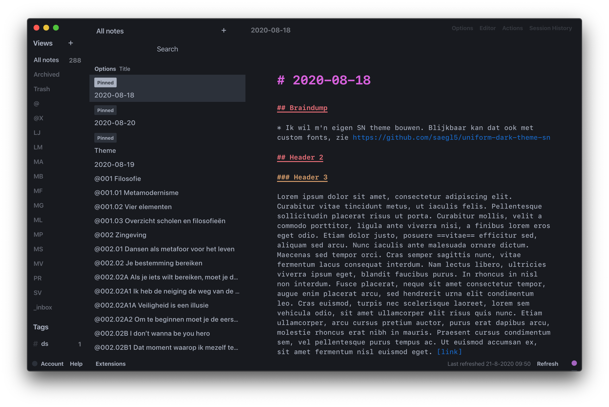

# VS Code One Dark Darker theme for Standard Notes

Theme for [Standard Notes](https://standardnotes.org/). Based on VS Code and my personal version of the [One Dark Darker](https://marketplace.visualstudio.com/items?itemName=JoelCrosby.one-dark-darker) theme.

Note: I've created this for personal use with the Markdown Pro editor on macOS. It's also been adapted to look nice with the 0.7.0 release of the [Rich Markdown Editor](https://github.com/arturolinares/sn-rme).

I can't guarantee it looks nice on any platform or editor. If you want some platform specific tweaks, shoot an issue.

## Installation

Open "Extensions" in Standard Notes and click "Import Extension". Enter the following URL as Extension Link and press Enter:

```
https://listed.to/p/VvOLflCGQW
```

## Preview


